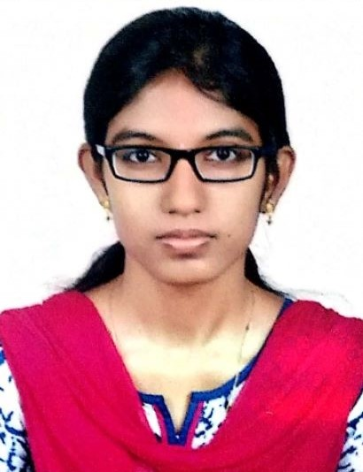

# aishwarya.github.io
<!DOCTYPE HTML>
<html lang="en"><head><meta http-equiv="Content-Type" content="text/html; charset=UTF-8">

  <title>Aishwarya V</title>
  
  <meta name="author" content="Aishwarya V">
  <meta name="viewport" content="width=device-width, initial-scale=1">
  
  <link rel="stylesheet" type="text/css" href="stylesheet.css">
	<link rel="icon" href="data:image/svg+xml,<svg xmlns=%22http://www.w3.org/2000/svg%22 viewBox=%220 0 100 100%22><text y=%22.9em%22 font-size=%2290%22>🌐</text></svg>">
</head>

<body>
    <table style="width:100%;max-width:800px;border:0px;border-spacing:0px;border-collapse:separate;margin-right:auto;margin-left:auto;"><tbody>
      <tr style="padding:0px">
        <td style="padding:0px">
          <table style="width:100%;border:0px;border-spacing:0px;border-collapse:separate;margin-right:auto;margin-left:auto;"><tbody>
            <tr style="padding:0px">
              <td style="padding:2.5%;width:63%;vertical-align:middle">
                

                  <name>Aishwarya V</name>
                

                
 I'm a civil engineer with a postgraduate degree in Remote Sensing and GIS at the National Institute of Technology Karnataka, Surathkal. 
                    I'm skilled in ArcGIS, QGIS, Google Earth Engine, ERDAS Imagine, SNAP, AutoCAD, and 3ds MAX. 
                    I've also applied the use of Python, JavaScript, and HTML in my projects.
                

                

                  <a href="mailto:aishwarya386@gmail.com">Email</a> &nbsp/&nbsp
                  <a href="data/AISHWARYA_V_RESUME.pdf">CV</a> &nbsp/&nbsp
                  <a href="https://www.linkedin.com/in/aishwarya-velmurugan-511501138/">LinkedIn</a> &nbsp/&nbsp
                  <a href="https://orcid.org/0000-0002-0601-5209">ORCiD</a>
                

              </td>
              <td style="padding:2.5%;width:40%;max-width:40%">
                
              </td>
            </tr>
          </tbody></table>
          <table style="width:100%;border:0px;border-spacing:0px;border-collapse:separate;margin-right:auto;margin-left:auto;"><tbody>
            <tr>
            <td style="padding:20px;width:100%;vertical-align:middle">
              <heading>Research</heading>
              

                I'm interested to work with drone and satellite based spatial datasets in land monitoring, DEM generation, and water projects. 
                The following are my academic works.
              

            </td>
          </tr>
        </tbody></table>
